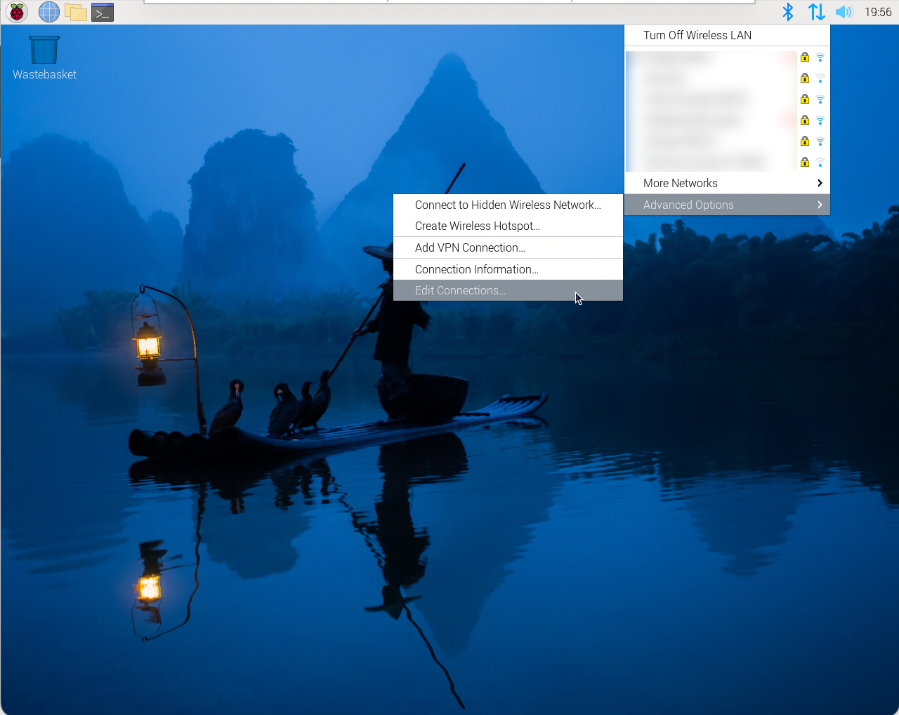
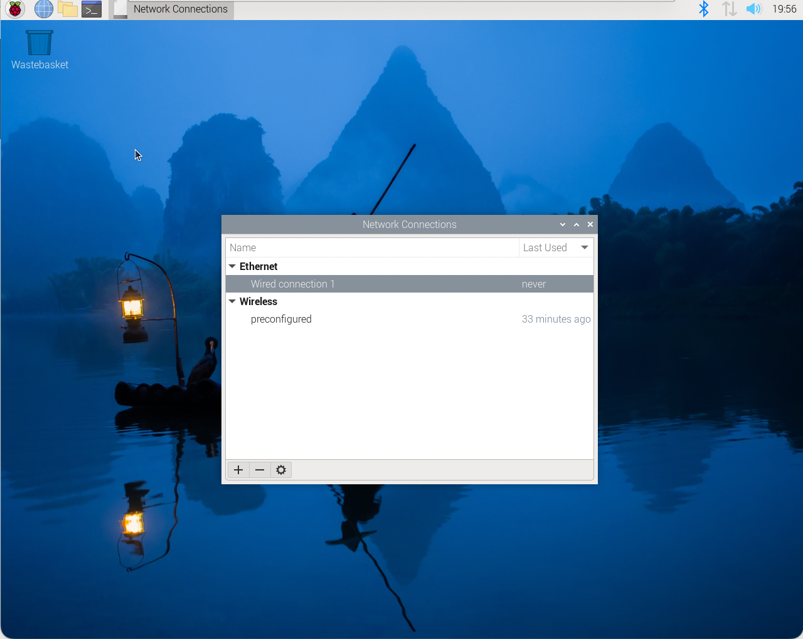
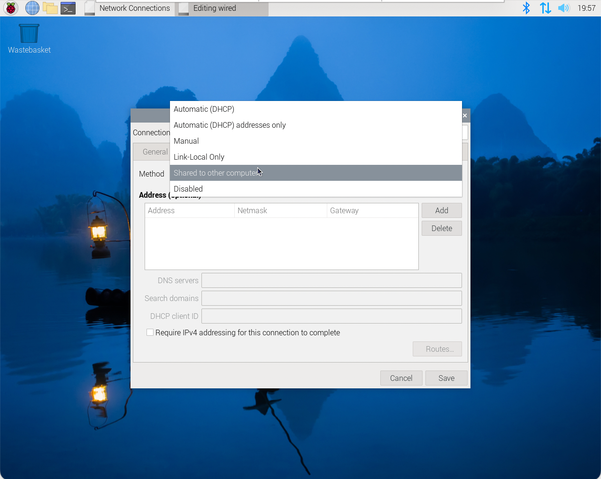
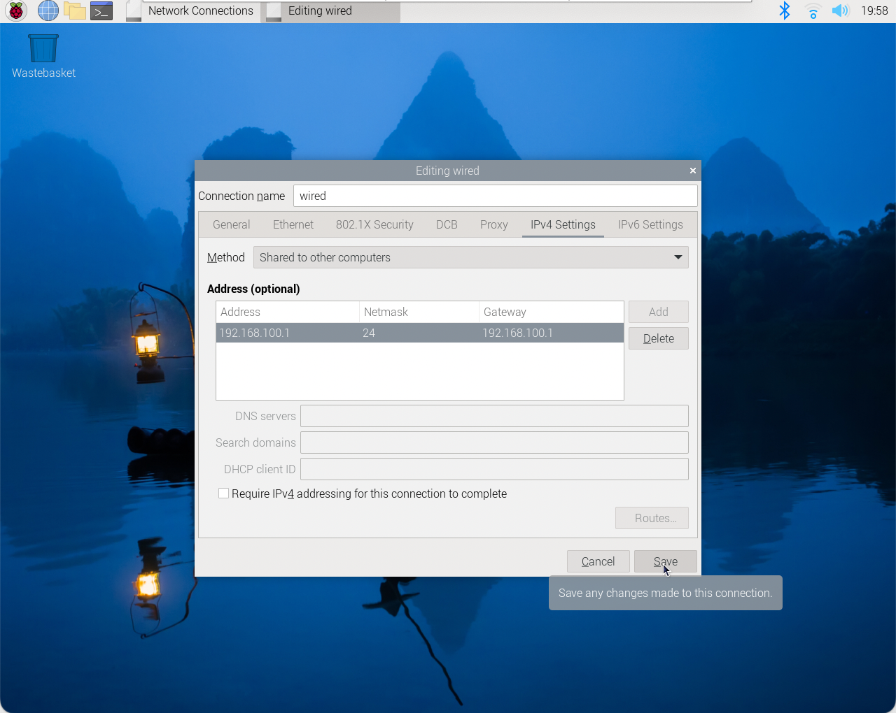
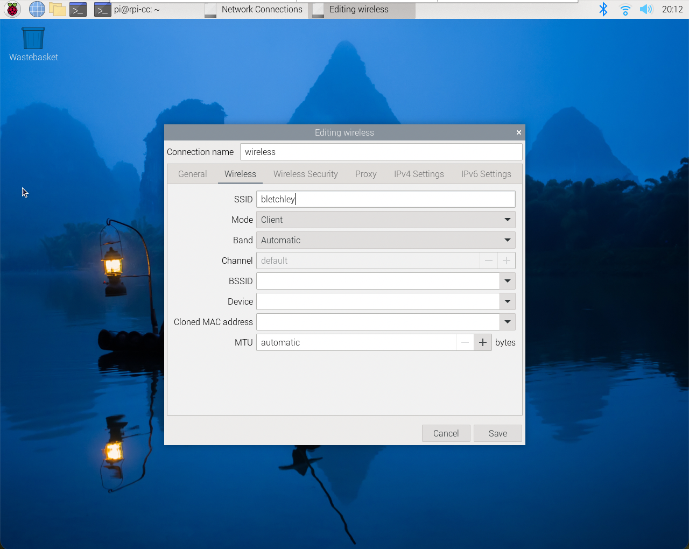
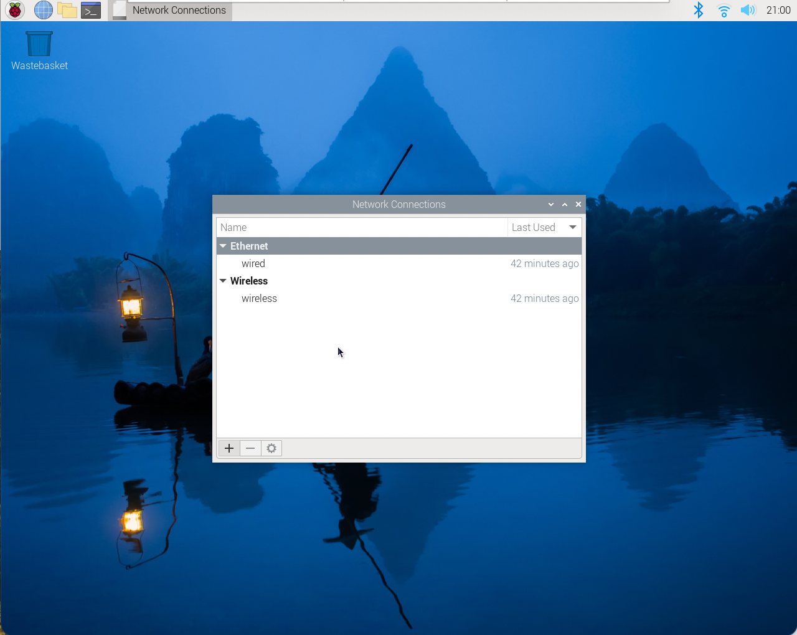

# idl4-cc-rpi-install | DEBIAN BOOKWORM

These instructions will guide you through the installation of your Raspberry Pi as we will use it during the IDL4-CC-labs.

## Prerequisites

1. Raspberry Pi 4B
2. A MicroSD with a freshly installed Raspberry Pi OS using [Raspberry Pi Imager](https://www.raspberrypi.com/software/)
3. Acces to an RJ-45 connector on your Mac or PC
4. Ethernet cable
5. Screen, keyboard & mouse (basic installation only)
6. [VNC® Viewer](https://www.realvnc.com/en/connect/download/viewer/) installed on your Mac or PC (optional)

## Basic installation

After these steps your Raspberry Pi will act as a wired router. Network traffic is forwarded in the Raspberry Pi so it is possile to access the internet while your Mac or PC is connected using an ethernet cable with the Raspberry PI.

### Step 1

To configure your WIFI on your Raspberry Pi there are multiple options. The easiest one is to configure it using the GUI. Select your wifi-network in the upper left corner and type in the password.

### Step 2

Everytime you install new things on your Raspberry Pi it's wise to update it first. On your Raspberry Pi, open a terminal window and type

    sudo apt update
    
Next, type

    sudo apt upgrade

When this is finished, your system is up-to-date. Now reboot your Raspberry Pi using

    sudo reboot
    
### Step 3 (optional)

Next we will enable VNC so it is possible to access the Raspberry desktop from the Mac or PC. In the terminal window type

    sudo raspi-config
    
Select **Interace Options**

Select **VNC**

Select **Yes** to enable VNC

**OK!**

Finally close raspi-config by selecting **Finish**

### Step 4

All the network configuration is done using the GUI (well except for one thing) in Debian Bookworm. We already configured the wireless network. Since we want to connect to the Rapsberry Pi with an ethernet connection and want to share it's internet we will set up a shared ethernet network with the Raspberry Pi as the gateway.

First connect an ethernet cable to the Raspberry Pi.

Next, click on **Edit Connections**

Click on **Wired connection 1**

In the menu IPv4 Settings, set the method to **Shared to other computers**

Set the address AND gateway to **192.168.100.1**. Also change the **Connection name** to **wired**

Finally, go back and change the name of the wireless connection as well. Set it to **wireless**.

Your final screen should look like this...

### Step 5

Now it's time to connect your Mac or PC with the ethernet-cable to the Raspberry Pi.

Give your Mac or PC a fixed IP-address in the same network range as the Raspberry Pi. I use **192.168.100.2** with a subnet of **255.255.255.0** but any other valid IP-address in the same network will work. Use the IP-address from the Raspberry PI - **192.168.100.1** as the router-address.

Set the DNS-server to **8.8.8.8**

Time to test the network connection. Open a terminal window on the Raspberry Pi. Type

    ping 192.168.100.2
    
You should get the following result.

From now on it's possible to use [SSH](https://en.wikipedia.org/wiki/Secure_Shell) to access our Raspberry Pi. On our Mac or PC open a terminal window and type

    ssh pi@192.168.100.1
    
Type in the password of the Raspberry Pi (the default password: raspberry)
   

Et voilà, from now we have remote access to the Raspberry Pi.

If you have enabled VNC and installed VNC Viewer on your Mac or PC it's also possible to work on the remote desktop of the Raspberry Pi if you prefer to work with a GUI.

### Step 6

Almost there! Our Raspberry Pi has internet connection but our Mac or PC has only access to the local network. The Raspberry Pi already shares its internet connection. But since the ethernet connection has a lower metric than wifi (this is a standard setting) we need to change this so the default traffic uses the wifi connection. 

Open a terminal window and type

    sudo nmcli connection modify wireless ipv4.route-metric 200
    
Where **wireless** is the name of the connection in **Network Connections**. In the same terminal window type

    sudo nmcli connection modify wired ipv4.route-metric 300

Again, **wired** is the name of the connection in **Network Connections.**

We have to reboot so the Raspberry Pi is using the new settings.

    sudo reboot

Now it's time to test if we have an internet connection. Fire up a browser on your Mac or PC and see if you can browse the internet. Alternatively you can open up a terminal window and type

    ping 8.8.8.8
    
You should get a window like this

## Visual Studio Code

Installing applications is a bit different on the Raspberry Pi. It's done using **apt** - a command-line utility for installing, updating, removing, and otherwise managing deb packages on Ubuntu, Debian, and related Linux distributions.

You have already used it to update your system with the command

    sudo apt update

and 

    sudo apt upgrade

Before we install new package, it's always wise to run these 2 commands.

To install Visual Studio Code you type

    sudo apt install code

Of course it's only available on the Raspberry Pi's GUI but it's a handy application. You can find it under Menu -> Programming -> Visual Studio Code.

## Node-RED (and NodeJS)

Node-RED is a programming tool for wiring together hardware devices, APIs and online services in new and interesting ways.

It provides a browser-based editor that makes it easy to wire together flows using the wide range of nodes in the palette that can be deployed to its runtime in a single-click.

It's a great tool to run on the Raspberry Pi since it can easyly be used as a back-end for your multimedia installation. There are multiple ways to run Node-RED but we will run it locally on our Raspberry Pi. More information and the complete installation procedure can be found on https://nodered.org/docs/getting-started/raspberrypi

There's a handy script that does most of the work for us. Let's run it by typing

    bash <(curl -sL https://raw.githubusercontent.com/node-red/linux-installers/master/deb/update-nodejs-and-nodered)

The script will ask if we want to run the Pi-specific nodes. This is handy if we want to use the GPIO-pins. So press **Y**. This might take a while so be patient

It will ask if we want to use specific settings - we'll leave this up for now. So press **N**

You can run Node-RED by typing

    node-red

Next, open up a browser-window on your Mac or PC and go to

    192.168.100.1:1880

And voilà, as you can see Node-RED is running on your Raspberry Pi.

You can stop Node-RED by pressin **ctrl-c**, Node-RED will be offline in your browser-window

It's better to run Node-RED in the background. This can be done by running it as a service.

You can start it by typing

    node-red-start

If we press **ctrl-c** you can notice Node-RED is still running in the background in your browser window.

We can stop it by typing

    node-red-stop

To have access to the Node-RED-log type

    node-red-log

You can also start the Node-RED service on the Raspberry Pi OS Desktop by selecting the Menu -> Programming -> Node-RED menu option. It will open up the Node-RED-log as well.

To autostart Node-RED when we boot the Raspberry Pi we have to enable it using **systemctl**

To enable it type

    sudo systemctl enable nodered.service

Disable the service can be done with

    sudo systemctl disable nodered.service
